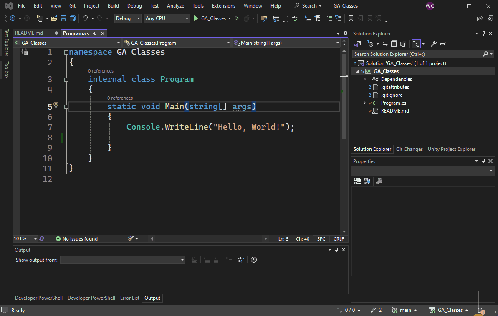
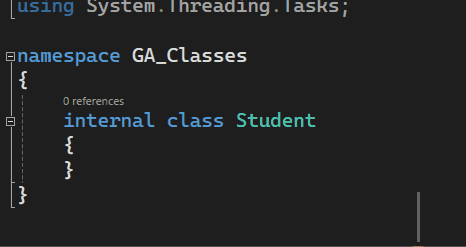
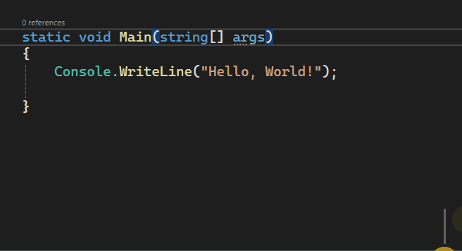
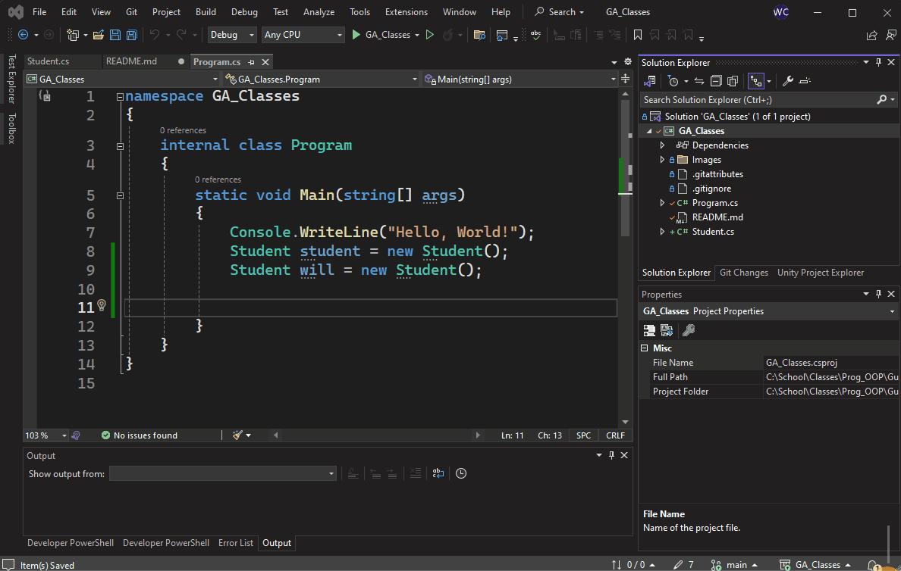

# Guided Assignment: Creating a Class

## Introduction

In C# a `class` is a user defined object that contains all the related variables and functionality related to that specific `class`. In this quick assignment we talk about how to create a class in C#.

### What is a Class in C#?

A class in C# is a blueprint for creating objects. It defines properties, fields, methods, and events. A class encapsulates data and the methods that operate on the data.

### Defining a Class in C#

**Example: Basic Class Definition**
```csharp
public class Person
{
 
}
```

### Creating and Using Objects

Objects are instances of a class. They are created using the `new` keyword followed by the class name and constructor.

**Example: Creating and Using an Object**
```csharp
Person person = new Person("Alice", 30);
```

---

## Requirements

1. Comment your name on your main class of your project.

```csharp
    class Program {
    
    // William Cram
    // Guided Assignment: Class
    // 01/02/2024
    }
```

2. Make sure your code properly builds and runs ( no compile errors. )

3. Follow the Step by Step instructions
- Create a new class `Student`
- Create two instances of that class in `Program.cs`
- Create a new class `Professor`
- Create an instance of `Professor`

4. Create you own class
- Create a class of your choice. A class can be anything.
- Ex. Towel, Watch, Player, Vehicle

5. Submit your GitHub repository online
 
---

**Video Walkthough**   
https://www.youtube.com/watch?v=NMQMtGv_Efg


## Step By Step

### 1. Adding a New Class

Adding a new class is a fairly straight forward process.

- Right-click on the project name in Solution Explorer.
- Select 'Add' then 'Class'. [Additional Hotkeys located below](#hotkeys)
- Name the class `Student` 
    - Standard Class naming conventions (uppercase start, singular form, no spaces).



### Setting Up the Class

The first thing we should do is change the world `internal` to `public` in our class. This is an access modifier and we discuss this later in the class.

- Newly created class appears in Solution Explorer with '.cs' extension.
- Change class accessibility from 'internal' to 'public'.



### Using the New Class

Now that we've created a new class, lets create our first `instance` of it. An instance is like an individual copy of a class.

### Creating an Instance:  
### ClassName - Variable Name = new ClassName();

The format for creating a `new` instance is the class name, then the variable name. followed by equals, the `new` keyword, and then the class name again. Followed by parenthesis. We talk about what this is in the `Constructor` assignment.

- Create an instance in the `Main` method, e.g., `Student student = new Student();`.
- Create a second instance with your name.



### Creating Additional Classes
- Repeat the process for additional classes like 'Professor'.
- Change to 'public' and save changes.
- Create a new instance of that class in `Main`.



### Final Step - Create your own class

Now that you've added 2 class, add your own. You will end up making hundreds and thousands in your career, so nows the time to get started. Make it about what everyone you want right now. You can always delete a class if you decide you don't need it. 

Remember
- Upper Case
- No spaces
- Singular

### Submission

Submit your github repository link in the text box on canvas

--- 

## Rubric

**Total Points: 100**

| Criteria                                             | Description                                                                                                          | Points |
|------------------------------------------------------|----------------------------------------------------------------------------------------------------------------------|-------|
| 1. Comment Authorship                                | Comment your name, assignment title, and date in the main class. Example provided in assignment instructions.         | 10    |
| 2. Code Execution                                    | The code must build and run without compile errors. This criterion is crucial for the assignment.                     | 30    |
| 3. Step-by-Step Implementation                       | - Create a new class `Student`. <br> - Create two instances of `Student` in `Program.cs`. <br> - Create a new class `Professor`. <br> - Create an instance of `Professor`. | 20    |
| 4. Creativity in Class Creation                      | Create an original class of your choice (e.g., Towel, Watch, Player, Vehicle). The class should be well thought out.  | 20    |
| 5. Submission of GitHub Repository                   | Submit the GitHub repository link containing the completed assignment.                                                | 10    |
| 6. Code Organization and Readability                 | Code should be well-organized, properly indented, and easy to read.                                                  | 5     |
| 7. Appropriate Use of Data Types and Class Properties| Use of data types and class properties should be appropriate and meaningful.                                          | 5     |

---

## Keywords


### 1. `class`
- **Definition**: A `class` in C# is a blueprint for creating objects. It defines the structure and capabilities of these objects.
- **Example**:
  ```csharp
  public class Car {
      // Class definition for Car
  }
  ```
  This example defines a class named `Car`.

### 2. `new`
- **Definition**: The `new` keyword in C# is used to instantiate objects of a class. It allocates memory for the object and initializes it.
- **Example**:
  ```csharp
  Car myCar = new Car();
  ```
  This line creates a new object of the `Car` class, referred to as `myCar`.

### 3. Instance
- **Definition**: An instance in C# refers to a specific object created from a class. Each instance is a separate entity with its own identity.
- **Example**:
  ```csharp
  Car myCar = new Car();
  Car anotherCar = new Car();
  ```
  In this example, `myCar` and `anotherCar` are two different instances of the `Car` class.


---

<a id="hotkeys"></a>
## Additional Hotkeys and Methods for Adding Classes

### Keyboard Shortcut for Adding New Item
- Use `Ctrl+Shift+A` for "Add New Item" dialog.

### Solution Explorer Shortcut
- Right-click in Solution Explorer, then press `A`, followed by `C`.

### Using the Command Window
- Open with `Ctrl+Alt+A` and type `>Project.AddClass [ClassName.cs]`.

### Context Menu in Code Editor
- Right-click and select “Add” > “Class” in the code editor.

### Customizing Keyboard Shortcuts
- Customize via `Tools > Options > Environment > Keyboard`.


OpenAI. ChatGPT. Accessed on December 3rd, 2023.